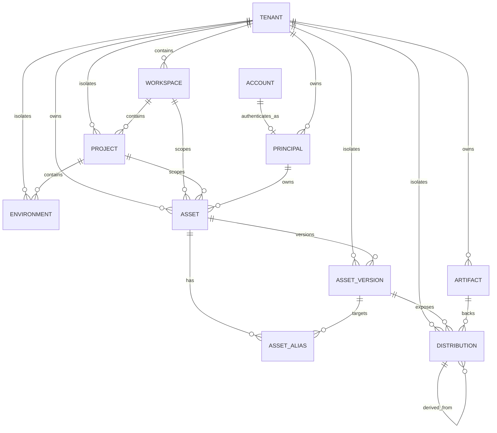

# Spatial Fabric Phase A ERD｜Tenancy + Principal + Asset Kernel

> 文档编号：SF-DB-PHASE-A-001  
> 状态：**migration 前置设计基线**  
> 范围：Tenant / Workspace / Project / Environment + Account/Principal + Asset Kernel

## 1. 本阶段目标

Phase A 只建立后续所有模块都依赖的最底层事实：

```text
Tenant → Workspace → Project → Environment
                  +
Account ↔ Principal
                  +
Asset → AssetVersion
       ├→ AssetAlias
       └→ Artifact / Distribution
```

Job/Run、ServiceDeployment、地图发布、GeoAgent、GeoServer 等不进入本阶段。

## 2. 核心原则

1. Tenant 是最高客户隔离边界。
2. Workspace/Project/Environment 显式保存 `tenant_id`，服务于 RLS、复合索引、查询防护与审计。
3. `Account` 只负责登录认证；`Principal` 负责 Fabric 授权主体身份。
4. `Asset / AssetVersion / Artifact / Distribution` 是四个独立 Aggregate Root。
5. Published AssetVersion 后续必须不可原地修改。
6. Provider-specific 信息不得成为核心字段。
7. 历史/证据相关引用默认 `PROTECT`，避免危险级联删除。
8. JSONB 只保存 schema-validated spec / 扩展技术元数据，不保存 tenant、owner、status、核心 FK。

## 3. ERD



## 4. Tenancy

### `sf_tenant`

```text
id UUIDv7 PK
name
slug UNIQUE
status
default_locale
default_timezone
data_residency_policy JSONB
lock_version
created_at / updated_at
```

### `sf_workspace`

```text
id
tenant_id FK PROTECT
name
slug
status
description
lock_version
timestamps
UNIQUE(tenant_id, slug)
```

### `sf_project`

显式保存 `tenant_id + workspace_id`。必须满足：

```text
project.tenant_id == project.workspace.tenant_id
```

当前由 `clean()` + Application Service 校验；正式 RLS/数据库增强在 IAM Phase 再评估。

### `sf_environment`

```text
tenant_id
project_id
name
slug
environment_type
status
protection_level
UNIQUE(project_id, slug)
```

必须满足：

```text
environment.tenant_id == environment.project.tenant_id
```

Environment 代表发布/版本绑定作用域，不是复制一套项目数据。

## 5. Account vs Principal

### `iam.Account`

Django `AUTH_USER_MODEL`，必须从第一次 migration 固定。使用 email 登录和 UUIDv7 PK。

Django 自带 `groups/user_permissions` 只服务框架后台权限，不等于未来 Fabric Role/Policy。

### `sf_principal`

统一授权主体：

```text
HUMAN_USER
SERVICE_ACCOUNT
AGENT
EXTERNAL_APPLICATION
FEDERATED
```

关键字段：

```text
id
tenant_id nullable
account_id nullable UNIQUE
principal_type
status
display_name
description
lock_version
timestamps
```

`tenant_id=NULL` 仅为平台级系统主体预留；普通租户用户/Agent/ServiceAccount 应显式属于 Tenant。

## 6. Asset 作用域

`sf_asset` 支持三级作用域：

```text
Tenant scope    : workspace_id NULL, project_id NULL
Workspace scope : workspace_id NOT NULL, project_id NULL
Project scope   : project_id NOT NULL
```

核心字段：

```text
tenant_id
workspace_id?
project_id?
asset_type
traits JSONB
name / slug / description
status
classification
owner_principal_id
steward_principal_id?
created_by_id
```

### Slug 条件唯一

不能简单依赖包含 NULL 的普通 UNIQUE，需要三条 PostgreSQL conditional unique constraint：

```text
Project scope:
UNIQUE(tenant, project, asset_type, slug)
WHERE project IS NOT NULL

Workspace scope:
UNIQUE(tenant, workspace, asset_type, slug)
WHERE project IS NULL AND workspace IS NOT NULL

Tenant scope:
UNIQUE(tenant, asset_type, slug)
WHERE project IS NULL AND workspace IS NULL
```

## 7. `sf_asset_version`

```text
id
tenant_id
asset_id
version_seq
version_label
schema_ref / schema_version
spec JSONB
metadata JSONB
content_hash
status
created_by_id
published_at
deprecated_at
replacement_version_id
```

约束：

```text
UNIQUE(asset_id, version_seq)
asset_version.tenant == asset.tenant
replacement_version.asset == asset
```

状态：

```text
DRAFT → VALIDATING → READY → PUBLISHED → DEPRECATED → ARCHIVED
```

正式发布必须由未来 `AssetPublicationService` 完成，禁止把“改 status 字段”当成完整发布流程。

## 8. `sf_asset_alias`

Alias 是可变指针，例如：

```text
stable
candidate
production
```

约束：

```text
UNIQUE(asset_id, alias)
target_version.asset_id == asset_id
```

Job/WorkflowRun 创建时必须 resolve 成具体 Version ID，运行记录禁止只保存 `latest/stable`。

## 9. `sf_artifact`

Artifact 是不可原地覆盖的物理/远程制品：

```text
id
tenant_id
digest_algorithm / digest
media_type
size
filename
storage_pool_ref
storage_object_ref
integrity_status
retention_class
legal_hold
```

当前 `storage_pool_ref` 是 provider-neutral UUID 稳定引用。禁止出现：

```text
minio_bucket
s3_bucket
oss_bucket
```

作为核心领域字段。

默认不做跨租户自动物理 dedup。

## 10. `sf_distribution`

Distribution 是 AssetVersion 的可消费访问形态，不等于 Artifact，也不等于 ServiceInstance endpoint。

```text
id
tenant_id
asset_version_id
distribution_type
format
protocol
status
access_mode
mutability
artifact_id?
source_distribution_id?
service_deployment_ref?
external_location_ref
spatial_metadata JSONB
temporal_metadata JSONB
technical_metadata JSONB
```

一个 DatasetVersion 可同时拥有：

```text
PostGIS
GeoParquet
COG
Zarr
PMTiles
WMS/OGC API Service Distribution
```

`service_deployment_ref` Phase A 先保留 Fabric UUID；Service Domain 完成后再升级为 FK。禁止存 GeoServer/Martin/TiTiler 内部 ID。

## 11. Tenant Isolation

当前：

- 核心 Root 显式 `tenant_id`；
- `clean()` 防止明显父子跨租户；
- 唯一约束带 tenant；
- 未来统一 Repository/Application Service 注入 tenant context。

Phase B 再正式决定：

```text
PostgreSQL RLS
platform principal bypass policy
worker tenant context
tenant switch audit
```

不在授权上下文尚未完成时草率启用 RLS。

## 12. 删除策略

默认 PROTECT：Tenant、Workspace、Project、AssetVersion、Artifact、Principal 等历史依赖。

仅明确内部从属对象（如 AssetAlias）可以 CASCADE。真正 Hard Delete 以后必须经过 Retention/Dependency Analysis，而不是 ORM 级联清库。

## 13. 索引优先级

第一阶段只建立明确查询路径的索引：

```text
Workspace(tenant,status)
Project(tenant,status)
Environment(project,type)
Principal(tenant,status/type)
Asset(tenant,type,status)
Asset(tenant,project,status)
AssetVersion(tenant,status)
AssetVersion(asset,status)
Artifact(tenant,digest_algorithm,digest)
Distribution(tenant,status)
Distribution(asset_version,status)
Distribution(type,format,status)
```

后续索引必须结合真实查询与 `EXPLAIN (ANALYZE, BUFFERS)`，不提前堆组合索引。

## 14. Migration 顺序

为了避免自定义 `AUTH_USER_MODEL` 的依赖复杂化：

```text
iam/0001_initial.py
  Account only

tenancy/0001_initial.py
  Tenant / Workspace / Project / Environment

iam/0002_principal.py
  Principal → tenancy.Tenant

assets/0001_initial.py
  Asset / Version / Alias / Artifact / Distribution
```

正式 migration 必须由真实 Django 5.2 环境生成/验证，不手写未经运行验证的迁移冒充生产可用。

## 15. Phase A 验收

```text
[ ] manage.py check
[ ] makemigrations --check --dry-run（正式 migration 固化后）
[ ] 空库 migrate
[ ] rollback/re-migrate 验证
[ ] custom Account / superuser
[ ] PostGIS readiness
[ ] 跨租户 invariant tests
[ ] Asset conditional unique constraints
[ ] Alias same-Asset constraint
[ ] Distribution cross-tenant Artifact 拒绝
```

全部通过后再进入 Phase B IAM & Governance。
